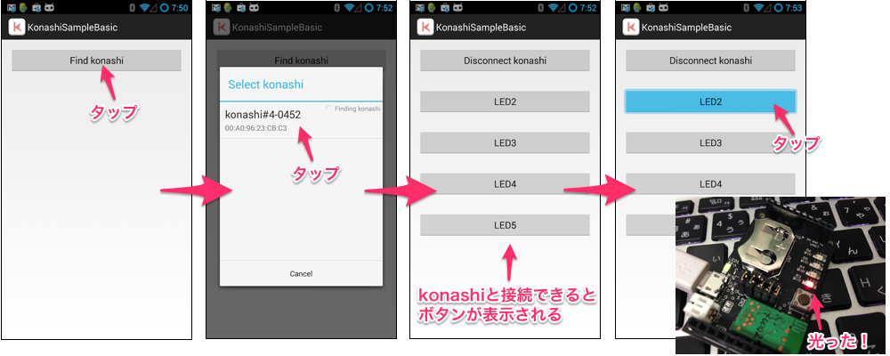

# konashi-v1 SDK for Android #alpha


スマートフォンでのフィジカルコンピューティングツールキットであるkonashi(version 1)のAndroid対応SDKです。

konashi2.0をお使いの方は、[konashi-android-sdk](https://github.com/YUKAI/konashi-android-sdk)をご利用ください。konashi-v1-android-sdkは将来的にkonashi-android-sdkへの統合を予定しています。

## 動作環境
- Android4.3以降 (SDK Version >= 18)
- Bluetooth Low Energy (Bluetooth4.0) 対応端末

## さくっとAndroidでkonashiを動かす
[Google Play](https://play.google.com/store/apps/details?id=com.uxxu.konashi.sample.basic)にてkonashi LEDピカピカアプリを公開中です。

プログラミングせずにAndroidでkonashiのLEDを動かすことができます！


## Getting started

#### まず konashi-android-sdk をダウンロード
```
$ git clone git@github.com:YUKAI/konashi-android-sdk.git
```

#### eclipse でライブラリのプロジェクトとしてインポート
`File -> Import`で Import ウィンドウを開く。<br/>
そして、`Android -> Existing Android Code into Workspace`を選択。<br/>
Import Projects ウィンドウが開くので、Root Directory にさきほどダウンロードした `konashi-android-sdk/Konashi`ディレクトリを指定して、Finishをクリック。

eclipse のプロジェクトに KonashiLib というライブラリプロジェクトが追加されているか確認してください。

##### サンプルプロジェクトを作成
eclipse でAndroidプロジェクトを作成してください。

#### konashi-android-sdk ライブラリをサンプルプロジェクトに追加
`Package Explorer`にて、サンプルプロジェクトを右クリックして`Properties`を選択。<br/>
Properties ウィンドウが開いたら左のプロパティリストの中にある`Android`という項目を選択。<br/>
Library の `Add` を押し、`KonashiLib`を選択。

これで konashi ライブラリを使えるようになりました。

#### BLEのパーミッション追加
Bluetooth を使えるように、AndroidManifest.xml に以下のパーミッションを追加。

```xml:AndroidManifest.xml
<uses-permission android:name="android.permission.BLUETOOTH"/>
<uses-permission android:name="android.permission.BLUETOOTH_ADMIN"/>
```

もし、BLE機能を持っているAndroidのみインストール可能にするには、AndroidManifest.xml に以下も追加。

```xml:AndroidManifest.xml
<uses-feature android:name="android.hardware.bluetooth_le" android:required="true"/>
```

#### コードを書く

[こちら](https://github.com/YUKAI/konashi-android-sdk/blob/master/samples/KonashiSampleBasic/src/com/uxxu/konashi/sample/basic/MainActivity.java)を参考に、LEDをチカチカさせるコードを書いてみましょう！

#### 実機で動かす



LEDを光らせることができたら成功です！

## APIリファレンス
Javadocで提供しています。

[http://yukai.github.io/konashi-android-sdk/docs/reference/com/uxxu/konashi/lib/package-summary.html](http://yukai.github.io/konashi-android-sdk/docs/reference/com/uxxu/konashi/lib/package-summary.html)


## 国内のBLE対応Androidに関して
### Android4.3以降が公式に提供されている端末
- Nexus 7(2013)
- Nexus 5
- GALAXY J
- GALAXY Note 3

### キャリアのBluetoothのスペック(4.0,BLE or not)
#### au
- [http://www.au.kddi.com/developer/android/kishu/bluetooth/](http://www.au.kddi.com/developer/android/kishu/bluetooth/)

## 開発について

### 機能要望やバグ報告をするには
開発者に要望を伝える報告する方法は以下です。

- GitHub の Issues に投稿
  - [https://github.com/YUKAI/konashi-android-sdk/issues](https://github.com/YUKAI/konashi-android-sdk/issues)
  - feature-requests、bug、discussion などのラベルをご使用ください。
- Pull Request
  - バグ見つけて修正しといたよ、というときは Pull Request を **develop ブランチ**に送ってください。
  - 詳細は ブランチの運用 をご覧ください。
- “konashi" をキーワードにつぶやく
  - twitter で #konashi のハッシュをつけるか、 konashi というキーワードを使って tweet してください。
  - もしくは konashi をキーワードにブログに書いてください。
- [contact@ux-xu.com](contact@ux-xu.com) にメールする
  - メールでの報告も受け付けています。
  
### ブランチの運用
[git-flow](https://github.com/nvie/gitflow) を使用しています。各ブランチの役割は以下です。

- master
  - リリース用のブランチです。GitHubでは master ブランチがデフォルトのブランチです。
- develop
  - 開発用のブランチです。
- feature/***
  - 新機能追加やバグ修正を行うブランチです。develop ブランチから feature ブランチを切り、開発が完了後に develop ブランチに merge します。
- release/v***
  - リリース前ブランチです。develop ブランチから release ブランチを切り、テストが終わり次第 master ブランチにマージされます。(現在は基本的に origin に push されません)


### タグの運用
基本的にリリース時にバージョン名でタグを切ります。konashi 公式ページからリンクされる zip ダウンロード先は最新のリリースタグの zip です。

タグ一覧は[こちら](https://github.com/YUKAI/konashi-android-sdk/tags)。

### Pull Request
**規模の大小関わらず、バグ修正や機能追加などの Pull Request 大歓迎！**

Pull Request を送るにあたっての注意点は以下です。

- 最新の develop ブランチから任意の名前でブランチを切り、実装後に develop ブランチに対して Pull Request を送ってください。
  - master ブランチへの Pull Request は(なるべく)ご遠慮ください。

### コマンド集
#### javadoc 生成
以下の ant コマンドを実行すると、docs ディレクトリに javadoc の html が生成される。

```
$ ant javadoc
```

## ライセンス
konashi のソフトウェアのソースコード、ハードウェアに関するドキュメント・ファイルのライセンスは以下です。

- ソフトウェア
  - konashi-android-sdk のソースコードは [Apache License Version 2.0](http://www.apache.org/licenses/LICENSE-2.0.html) のもと公開されています。
- ハードウェア
  - konashi の回路図などハードウェア関連のドキュメント・ファイルのライセンスは [クリエイティブ・コモンズ・ライセンス「表示-継承 2.1 日本」](http://creativecommons.org/licenses/by-sa/2.1/jp/deed.ja)です。これに従う場合に限り、自由に複製、頒布、二次的著作物を作成することができます。
  - [こちらに公開しています](https://github.com/YUKAI/konashi-ios-sdk/tree/master/documents)
- konashi のBLEモジュールのファームウェアは [csr社](http://www.csr.com/) とのNDAのため公開しておりません。

## 関連
- [YUKAI/konashi-ios-sdk](https://github.com/YUKAI/konashi-ios-sdk): konashi SDK for iOS

